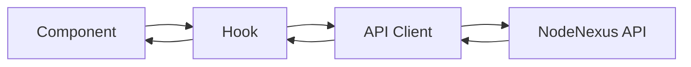

# Architecture Overview

## Tech Stack

- **Framework:** React 19
- **Language:** TypeScript 6
- **Build:** Vite 8
- **Styling:** TailwindCSS 4

## Directory Structure

```
src/
├── api/            # API client layer (REST endpoints)
├── components/     # UI components
│   ├── ui/         # Reusable UI primitives
│   ├── docker/     # Docker page components
│   ├── nodes/      # Node-specific components
│   ├── commands/   # Command-specific components
│   ├── scripts/    # Script-specific components
│   ├── guards/     # Route guards (AuthGuard)
│   └── layout/     # Layout components (ThemeToggle, MobileMenu)
├── hooks/          # Custom React hooks
├── i18n/           # Internationalization (en/ru locales)
├── layouts/        # Page layout wrappers
├── lib/            # Utilities, validators, query client
├── mocks/          # MSW mock handlers and test data
├── pages/          # Route-level page components
├── stores/         # Zustand stores (auth, UI state)
├── styles/         # Theme configuration
├── test/           # Test setup and utilities
├── App.tsx         # Root component
└── main.tsx        # Entry point
```

## Data Flow


