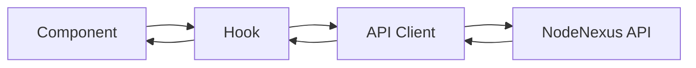

# Architecture Overview

## Tech Stack

- **Framework:** React 19
- **Language:** TypeScript 6
- **Build:** Vite 8
- **Styling:** TailwindCSS 4

## Directory Structure

```
src/
├── components/     # Reusable UI components
├── pages/          # Route-level components
├── hooks/          # Custom React hooks
├── utils/          # Utility functions
├── api/            # API client layer
├── assets/         # Static assets
├── App.tsx         # Root component
└── main.tsx        # Entry point
```

## Data Flow


