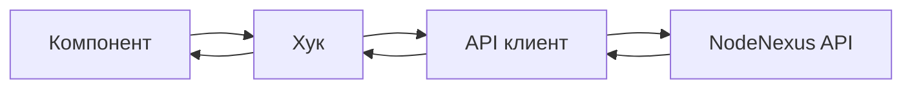

# Обзор архитектуры

## Технологический стек

- **Фреймворк:** React 19
- **Язык:** TypeScript 6
- **Сборка:** Vite 8
- **Стилизация:** TailwindCSS 4

## Структура директорий

```
src/
├── components/     # Переиспользуемые UI компоненты
├── pages/          # Компоненты маршрутов
├── hooks/          # Пользовательские React хуки
├── utils/          # Утилиты
├── api/            # API клиент
├── assets/         # Статические файлы
├── App.tsx         # Корневой компонент
└── main.tsx        # Точка входа
```

## Поток данных


