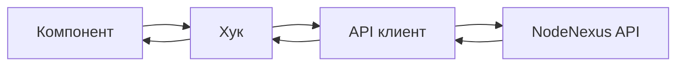

# Обзор архитектуры

## Технологический стек

- **Фреймворк:** React 19
- **Язык:** TypeScript 6
- **Сборка:** Vite 8
- **Стилизация:** TailwindCSS 4

## Структура директорий

```
src/
├── api/            # Клиентский слой API (REST-эндпоинты)
├── components/     # UI-компоненты
│   ├── ui/         # Переиспользуемые UI-примитивы
│   ├── docker/     # Компоненты страницы Docker
│   ├── nodes/      # Компоненты, специфичные для нод
│   ├── commands/   # Компоненты, специфичные для команд
│   ├── scripts/    # Компоненты, специфичные для скриптов
│   ├── guards/     # Защитники маршрутов (AuthGuard)
│   └── layout/     # Компоненты макета (ThemeToggle, MobileMenu)
├── hooks/          # Пользовательские React-хуки
├── i18n/           # Интернационализация (en/ru локали)
├── layouts/        # Обёртки макета страниц
├── lib/            # Утилиты, валидаторы, клиент запросов
├── mocks/          # Обработчики моков MSW и тестовые данные
├── pages/          # Компоненты страниц на уровне маршрутов
├── stores/         # Хранилища Zustand (аутентификация, UI-состояние)
├── styles/         # Конфигурация темы
├── test/           # Настройка тестов и утилиты
├── App.tsx         # Корневой компонент
└── main.tsx        # Точка входа
```

## Поток данных


